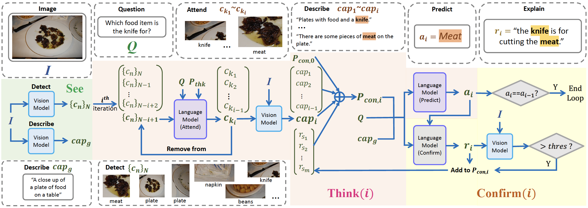

Code for [paper](https://arxiv.org/abs/2301.05226) *Visual Chain-of-Thought Prompting for Knowledge-based Visual Reasoning*
## Overall framework


## Preprocess datasets
* Coco dataset 2014 and 2017
* Download OK-VQA and AOK-VQA dataset, following the [PICa](https://github.com/microsoft/PICa) format
* Run preprocess script (`preprocess/preprocess_aokvqa.sh` for AOK-VQA and `preprocess/preprocess_okvqa.sh`) for OK-VQA
* Make training object similarity file (`object_similarity/object_similarity_aokvqa.sh` for AOK-VQA and `object_similarity/object_similarity_okvqa.sh` for OK-VQA)
## Prepare Scene graph and captions
* Before running experiments, VisualCoT also need scene graph and captions, including three files for each input image (under `input_text/scene_graph_text/scene_graph_coco17`, `input_text/scene_graph_text/scene_graph_coco17_attr`, and `input_text/scene_graph_text/scene_graph_coco17_caption`). We have provided an example of image No.57 under each dir. Please follow the format of the examples and get scene graphs for all other images.
* If you do not want to inference a scene graph model to get the scene graphs, here we provide the scene graphs and captions we generated (need additional process to match the format of above three examples):
  * [Dense Captions](https://connecthkuhk-my.sharepoint.com/:u:/g/personal/u3004417_connect_hku_hk/EXEt5csE_QdOmbnsTO-nGV0BBdYCZOR02RSMTjPUqb9rKg?e=JaauMJ) for AOKVQA validation set.
  * [Dense Captions](https://connecthkuhk-my.sharepoint.com/:u:/g/personal/u3004417_connect_hku_hk/ESGWoKHJzztBm93WolMXZ5wB-zT1_Ke04ZrEl28PeiV6_Q?e=dBsfGz) for AOKVQA test set.
  * [Dense Captions](https://connecthkuhk-my.sharepoint.com/:u:/g/personal/u3004417_connect_hku_hk/EWp9Uez63_RGokjmYxf1Y30BUVCOeWHfXW0UaLHcguHSNg?e=HL48If) for AOKVQA training set.
  * [Attributes](https://connecthkuhk-my.sharepoint.com/:u:/g/personal/u3004417_connect_hku_hk/EXr9OBbMQZpIqzjGiMNEEQoB2Hf6cUQ8pdMr9WVzMN8Kgg?e=6ag5Q9) for COCO17 test dataset.
  * [Relations and Objects](https://connecthkuhk-my.sharepoint.com/:u:/g/personal/u3004417_connect_hku_hk/EQhrPTf8w9FDs2RydtfKH6kBYbi9aIU_b7iNgJ3ryzcH_w?e=WLJMYN) for COCO17 test dataset.
  * [Attributes](https://connecthkuhk-my.sharepoint.com/:f:/g/personal/u3004417_connect_hku_hk/EtgkHlLUW9dFuugco63C7ZoB7KSsxx-YpDHEZ6JLjp2gNQ?e=ALLWeu) for COCO17
  * [Relations and Objects](https://connecthkuhk-my.sharepoint.com/:u:/g/personal/u3004417_connect_hku_hk/ERydz2RGCSpCgFOcFqK-okYBTqBb-dHqZmT0WEWNGpQShw?e=h1ADHR) for COCO17
## Run experiments
* `run_aokvqa.sh` for AOK-VQA
* `run_okvqa.sh` for OK-VQA
## Main Results
| Backbone    | OK-VQA test (DA) | AOK-VQA val (DA) | AOK-VQA test (DA) |
|-------------|------------------|------------------|-------------------|
| OPT-66B     | 44.6             | 46.4             | 46.0              |
| Llama-2-70B | 54.9             | 50.5             | 54.4              |
## Cite
arXiv version
```
@article{chen2023see,
  title={See, think, confirm: Interactive prompting between vision and language models for knowledge-based visual reasoning},
  author={Chen, Zhenfang and Zhou, Qinhong and Shen, Yikang and Hong, Yining and Zhang, Hao and Gan, Chuang},
  journal={arXiv preprint arXiv:2301.05226},
  year={2023}
}
```
